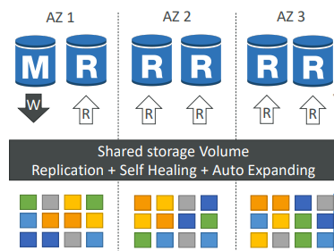
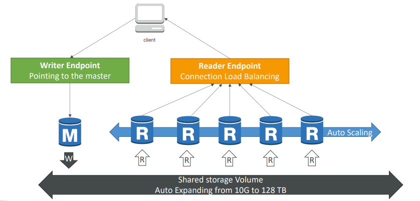
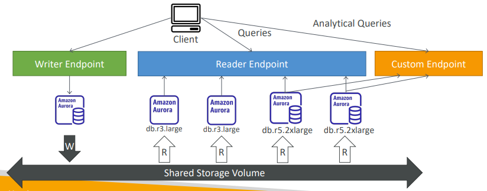
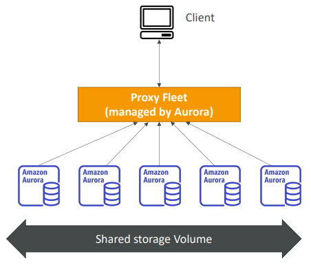
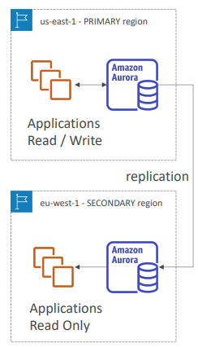
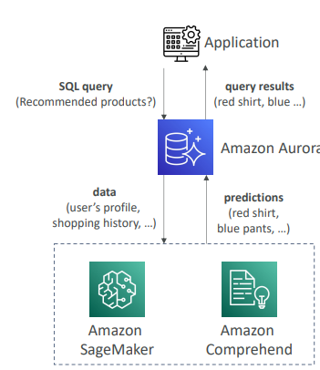
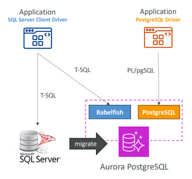
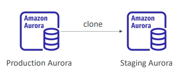

# Amazon Aurora

Banco de dados relacional de tecnologia proprietária da AWS.

Postgres e MySQL são suportados como Aurora DB.

Aurora é um `AWS Cloud Optmized` e performa até 5x mais que MySQL no RDS e 3x mais que o Postgres RDS.

Aurora storage cresce automaticamente em incrementos de 10 GB, até 128 TB.

Aurora pode ter até 15 replicas e o processo de replicação é mais rápido que o MySQL (menos de 10 ms de replica lag).

Failover no Aurora é instantâneo. É `High Availability Native`.

Aurora custa mais que o RDS (20% mais), mas é mais eficiente.

---

## Aurora High Availability e Read Scaling

Aurora armazena 6 cópias do seu dado em 3 AZs:

* Uma instância aurora recebe escritas (master);
* Failover automático em menos de 30 segundos;
* Master + até 15 Aurora Read Replicas servem leitura.

---

## Aurora DB Cluster

---

## Custom Endpoint

---

## Aurora Serverless

---

## Global Aurora

* 1 Primary Region;
* Até 5 secondary (read-only) regions;
* lag replication é menor que 1 segundo;
* Até 16 Read Replicas por secondary region;
* Ajuda a reduzir latência;
* Promoting para outra região (disaster recovery) tem um RTO < 1 minuto;
* Replicação típica cross-region leva menos de 1 segundo.

---

## Aurora Machine Learning

Te habilita a adicionar predições baseadas em ML na suas aplicações via SQL.

---

## Babelfish para Aurora PostgreSQL

Permite que o Aurora PostgreSQL entenda comandos de MS SQL Server (T-SQL), permitindo que aplicações baseadas em MS SQL Server funcionem com o Aurora PostgreSQL.

Não necessita nenhuma mudança no código (usando o mesmo MS SQL Server Client Driver).

---

## Aurora database cloning

Criação de um novo Aurora DB Cluster a partir de um existente. É mais rápido que um snapshot e restore.

Usa `copy-on-write` protocol:

* Inicialmente, o novo DB Cluster utiliza o mesmo volume de dados que o DB Cluster original (rápido e eficiente - nenhuma cópia é necessária);
* Quando atualizações são feitas nos dados do novo DB Cluster, então storage adicional é alocado e o dado é copiado para ser separado.

