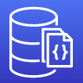

#  Estudos de AWS Document DB

Estudos do AWS Document DB.

> **Sumário**
>
> - [1. Introdução](#1-introdução)

---

## 1. Introdução

Banco de Dados NoSQL compatível com `Mongo DB` usado para armazenar, consultar e indexar dados em formato de JSON.

Totalmente gerenciado pela AWS, alta disponibilidade com replicação em 3 AZs.

Document DB storage escala automaticamente em incrementos de 10 GB.

Também escala automaticamente para workloads com milhões de requisições por segundo.