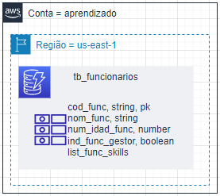
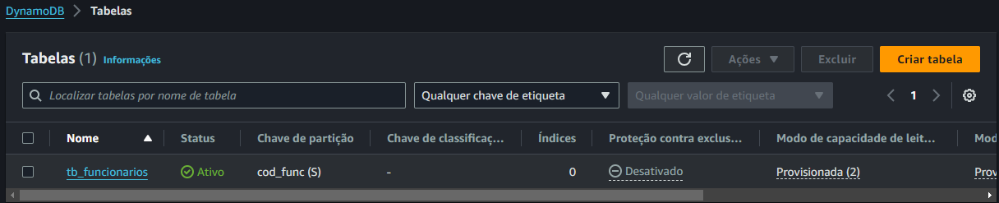
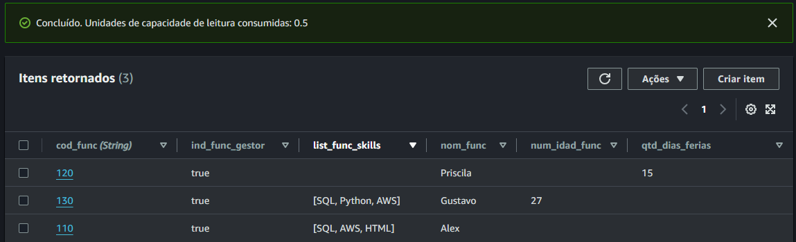

# Prática de DynamoDB

Cenários práticos de implementações com DynamoDB.

---

### [1. Create Table + Itens](/Pratica/CreateTable-Itens)

Criar a tabela `tb_funcionarios` com informações de funcionários com a seguinte estrutura.

**Resultado:**

Tabela:

Itens

---