#  Estudos de AWS Dynamo DB

Estudos do AWS DynamoDB.

> **Sumário**
>
> - [1. Introdução](#1-introdução)
> - [2. Conceitos e Componentes do DynamoDB](#2-conceitos-e-componentes-do-dynamodb)
> - [3. Índices Secundários](#3-índices-secundários)
> - [4. Casos de uso em Big Data](#4-casos-de-uso-em-big-data)
> - [5. Capacidade de Leitura/ Escrita](#5-capacidade-de-leitura-escrita)
> - [6. Dynamo DB Accelerator (DAX)](#6-dynamo-db-accelerator-dax)
> - [7. Dynamo DB Streams](#7-dynamo-db-streams)
> - [8. APIs do Dynamo DB](#8-apis-do-dynamo-db)

---

### 1. Introdução

Banco de dados NoSQL de latência extremamente baixa (< 10 milissegundos) para aplicações de alto desempenho. Totalmente gerenciado e escalável. Muito recomendado para utilização com App Web/ Mobile e Games. Possui replicação entre multiplas AZs.

**NoSQL Databases**

* NoSQL Databases são não-relacionais e distribuídos (horizontal scale);
* Não suportam query joins (ou possuem suporte limitado);
* Todos os dados necessários para a query estão presentes em uma linha;
* Não performam agregações como SUM, AVG, ...

**Performance**

* Milhões de requisições por segundo;
* Trilhões de linhas;
* Centenas de TB de storage;
* Rápido e consistente em performance (baixa latência em retrieval).

Dynamo DB oferece criptografia em repouso, te permite aumentar e diminuir a taxa de transferência da tabela, oferece recursos de backup sob demanda e backups contínuos com recuperação point-in-time (rollback para timestamp nos últimos 35 dias) e te permite excluir automaticamente itens expirados da tabela (TTL - Time to Live).

Os dados do DynamoDB são armazenados em discos SSD e automaticamente replicados entre várias AZs (>= 3 AZs). Você pode usar **tabelas globais** para manter as tabelas do DynamoDB sincronizadas.

---

### 2. Conceitos e Componentes do DynamoDB

- **Tabela**: Coleção de itens. No DynamoDB você não cria "bancos de dados", cria diretamente uma Tabela. A Tabela no DynamoDB tem o mesmo conceito que uma tabela no BD Relacional.

- **Itens**: Coleção de atributos. Cada item é identificado exclusivamente por uma **Chave Primária (PK)** informada no momento de criação da tabela. O item é o equivalente a uma linha no BD Relacional. No DynamoDB, não há limites para o número de itens que a sua tabela pode ter.

- **Atributos**: elemento de dados fundamental (nome, data de nascimento, funcional, squad). Os atributos são o equivalente das colunas do BD Relacional, porém mais poderosos pois aceitam valores aninhados (nested attributes). Os atributos podem ser de dois tipos:

    - Atributo Escalar: possui apenas um valor;
    - Atributo Aninhado/ Composto: possui mais de um valor. DynamoDB suporta atributos aninhados com até 32 níveis de profundidade. É como se fosse um mapa do Python.

> Obs.: o tamanho máximo de um único item (row) é 400KB.

Data types suportados para os atributos:

- Tipos escalares:
    
    - String
    - Number
    - Binary
    - Boolean
    - Null

- Tipo de documento:

    - Lista
    - Mapa

> Observação: não existem os data types `date` e `timestamp` no DynamoDB. Para representar datas, podemos usra o padrão **tempo epoch**, que é o número de segundos (int) desde 00:00:00 UTC em 01/01/1970.

- **Chave Primária (PK)**: ao criar a tabela, você deve obrigatoriamente especificar a PK. DynamoDB é compatível com dois tipos de chaves primárias:

    - **Partition Key**: chave primária simples, formada por um atributo escalar. Deve ser única para cada item. Para PK simples o valor máximo de partition key é de 2 KB;
    - **Partition Key + Sort Key**: chave primária composta, formada por dois atributos escalares. A combinação da PK e da SK precisa ser única pra cada item. Para PK composta o valor máximo do sort key é 1 KB.

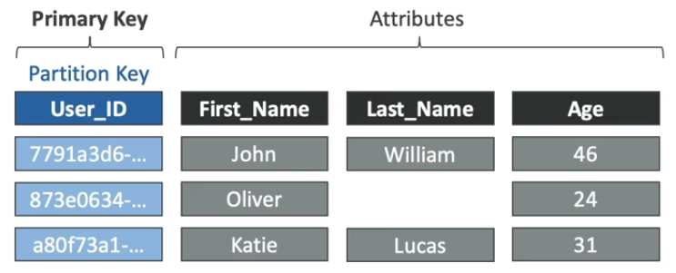

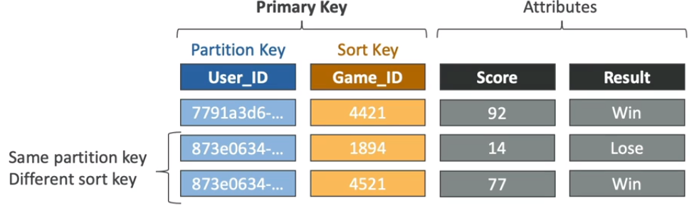

DynamoDB utiliza a Partition Key como entrada para uma função de hash interna. A saída dessa função de hash determina a partição (onde o item com aquele partition key será armazenado fisicamente no DynamoDB). Todos os itens com o mesmo partition key são armazenados juntos e ordenados pelo sort key.

Cada atributo da chave primária precisa ser um atributo escalar (string, number, boolean) e uma boa prática, é escolher um partition key que distribua os itens o máximo possível de mode que evite que muitos itens sejam armazenados juntos em uma mesma partição. Por exemplo, escolher ID_SQUAD como partition key é uma escolha ruim, pois todos os membros vão ser armazenados na mesma partição e squads muito grandes sentirão o impacto do problema de **Hot Key** (partição acessada muitas vezes). Uma boa escolha seria usar a FUNCIONAL como Partition Key.

**Table Class**

- Standard: default table para propósitos gerais para tabelas que armazenam dados acessados com frequência;
- Standart-IA: para tabelas que armazenam dados que não são acessados com frequência. Possui custo de armazenamento menor.

**Read/Write Capacity**

- On-demand: capacidade de leitura/ escrita se adapta as necessidades da aplicação;
- Provisionada: o usuário define quanto irá alocar de capacidade de leitura/ escrita para a tabela.

**Criptografia**

É possível criptografar os dados em repouso utilizando:

- Amazon DynamoDB Key: usa chave do KMS gerenciada pelo DynamoDB. Não há cobrança adicional por usá-la;
- AWS Managed Key: chave do KMS informada pelo usuário. Há custos do KMS envolvidos;
- Key gerenciada pelo cliente: Chave KMS criada e gerenciada pelo cliente. Há custos do KMS envolvidos.

Criptografia em trânsito usando SSL/TLS.

**Backups**

O processo de backup e restauração sob demanda é dimensionado sem degradar a performance nem a disponibilidade dos seus aplicativos. Ele usa uma tecnologia distribuida exclusiva que permite a realização de backups em questão de segundos, independentemente do tamanho da tabela.

Você também consegue recuperar a tabela em qualquer timestamp dentro dos últimos 35 dias (point in time recovery - PITR). O Dynami DB mantém backups incrementais da tabela. Além disso, as operações point-in-time não afetam o desempenho ou as latências de APIs.

**Segurança**

VPC Endpoint disponível para acessar o serviço sem internet (interface gateway, como para o S3). Acesso controlado por IAM.

É possível fazer **fine-grained access control** usando Web Identity Federation ou o Cognito Identity Pools, usando as credenciais do usuário, atrelando-as a uma role, para configurar row-level limit access para os usuários com base na Primary Key.

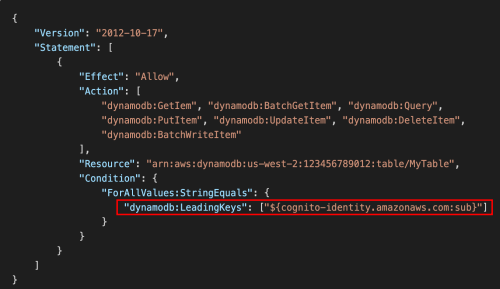

---

### 3. Índices Secundários

Te permitem consultar os dados na tabela usando uma chave alternativa, além de consultas na chave primária. Existem dois tipos:

#### 3.1. Local Secondary Index (LSI)

Um íncide que possui a mesma Partition Key da tabela, porém, tem uma Sort Key diferente.

Cada tabela no Dynamo DB pode ter até 5 índices secundários locais e o LSI precisa ser definido no momento de criação da tabela (após criada, não é possível criar/modificar um LSI).

**Attribute Projections:** você pode escolher se quer projetar no LSI:

* KEYS_ONLY: apenas as chaves;
* INCLUDE: você seleciona os atributos para projeção;
* ALL: projeção de todos os atributos da tabela.

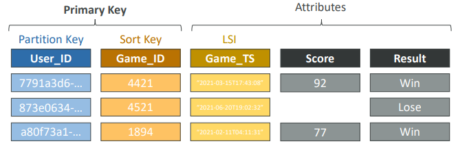

LSI utiliza WCU e RCU da tabela principal.

---

#### 3.2. Gloabl Secondary Index (GSI)

Um índice com Partition Key + Sort Key que podem ser diferentes dos que estão contidos na tabela.

Cada tabela no Dynamo DB pode ter até 20 índices secundários globais e o GSI pode ser criado/alterado após a tabela já ter sido criada.

Também suporta attibute projection como LSI, porém, você precisa provisionar RCU e WCU para o índice.

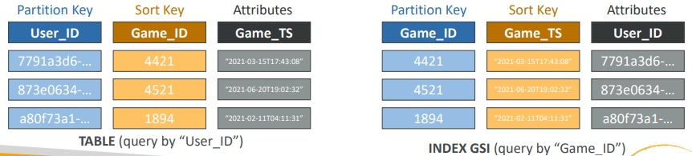

Se as escritas no GSI sofrerem throttled, a tabela principal também sofrerá, indpendentemente do WCU da main table.

---

### 4. Casos de uso em Big Data

Casos de uso comuns do Amazon DynamoDB em Big Data:

* Mobile apps;
* Gaming;
* Digital ad serving;
* Live voting;
* Audience interaction for live events;
* Sensor networks;
* Log ingestion;
* Access control for web-based content;
* Metadata storage for Amazon S3 Objects;
* E-commerce shopping carts;
* Web session management.

**Anti Pattern**

* Lift and Shift de uma aplicação que usa banco de dados tradicional (use RDS nesse caso);
* Joins ou transações complexas;
* Binary Large Object (BLOB): armazene os dados no S3 e metadados no DynamoDB;
* Dados volumosos com baixo range de I/O: ao invés disso use S3.

> DynamoDB é ótimo para dados quentes e pequenos. S3 é melhor se o dado for mais frio e maior.

---

### 5. Capacidade de Leitura/ Escrita

Read/Write Capacity Mode controla como você gerancia a capacidade de throughput da sua tabela.

Existem 2 modos:

- Provisionado (default): você especifica o número de leituras/escritas por segundo. Você precisa planejar a capacidade antecipadamente e paga pelas unidades de leitura e escrita provisionadas;
- On-Demand: leituras/ escritas escalam automaticamente com o seu workload. Não há necessidade de planejar a capacidade. Pague pelo que usar (mais caro que o provisionado).

É possível alterar entre diferentes modos uma vez a cada 24 horas.

> **RCU** = Read Capacity Unit -> throughput de leitura;
>
> **WCU** = Write Capacity Unit -> throughput de escrita.
>
> São as unidades de medida para faturamento da capacidade da tabela.

---

#### 5.1. Read/Write Capacity Modes - Provisioned

A tabela precisa ter RCU e WCU provisionados e há opção de configurar **auto-scaling** para o throughput conforme a demanda.

O throughput pode exceder sua capacidade temporariamente usando **Burst Capacity** conforme você utiliza RCU e WCU.

Se você exceder o Burst Capacity, irá tomar um erro do tipo **ProvisionedThroughputExceededException**.

Para resolver, você pode adotar uma estratégia de **Exponential Backoff**, na qual você tentar executar a transação em períodos de tempo exponenciais. Exemplo:

- 1ª tentativa (instante 0s);
- 2ª tentativa (1s depois);
- 3ª tentativa (2s depois);
- 4º tentativa (4s depois);
- 5ª tentativa (8s depois);
- 6ª tentativa (16s depois);
- ...
- timeout que você define (como 120s por exemplo).

É possível utilizar Auto-Scaling para ajustar a capacidade provisionada automaticamente.

---

#### 5.2. Write Capacity Units (WCU)

1 WCU representa uma escrita por segundo para um item de até 1 KB de tamanho.

Se o item for maior que 1 KB, mais WCU será consumida.

Exemplo 1: quantos WCUs são necessários para escrita de 10 itens por segundo, com tamanho de 2 KB?

> Nesse caso, nossa necessidade é de escrever (10 itens) x (2 KB) = 20 KB/s. Para isso, precisamos de 20 WCUs.

Exemplo 2: quantos WCUs são necessários para escrita de 6 itens por segundo, com itens de 4.5 KB?

> (6 itens) x (4.5 KB), porém, a AWS não provisiona frações de WCU, apenas valores inteiros (4 ou 5, não provisiona 4.5 WCU). Dessa forma, é preciso arredondar o 4.5 KB pra cima, para 5 KB. Assim precisamos de (6 itens) x (5 KB) = 30 WCUs.

---

#### 5.3. Strongly/ Eventually Consistent Read

Por ser gerenciado pela AWS, o DynamoDB faz replicação dos dados das tabelas em pelo menos 3 AZs diferentes. Por conta disso, em situações onde uma aplicação faz uma escrita seguida de uma leitura, pode ser que a escrita ocorra em um servidor e a leitura em outro.

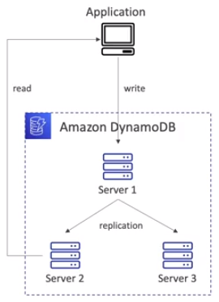

Observe que nesse cenário, é possível que os dados na leitura da tabela ainda não contenham os dados escritos pela aplicação por conta do tempo de replicação do DynamoDB (que geralmente é de 100 milissegundos).

Por isso, há 2 modos de consistência de leitura:

**Eventually Consistent Read (default)**

Se lermos logo após uma escrita, é possível que recebamos os dados desatualizados por conta da replicação;

**Strongly Consistent Read**

Se lermos logo após uma escrita, teremos o dado atualizado pois aguardaremos a replicação terminar para ler o dado.

Nas chamadas de API, é preciso setar o parâmetro **ConsistentRead = true** (GetItem, BatchGetItem, Query, Scan).

O ponto negativo é que leituras fortemente consistentens consomem o dobro de RCU.

---

#### 5.4. Read Capacity Units (RCU)

1 RCU representa 1 Strong Consistent Read por segundo, ou 2 Eventually Consistent Reads por segundo, para um item de até 4 KB de tamanho.

> **Ponto de atenção para RCU**:
>
> 1 RCU é definido para um item de até 4 KB, dessa forma, o RCU aumenta para múltiplos de 4 KB (4 KB, 8 KB, 12 KB, ...), de modo que o arredondamento é feito sempre para o próximo múltiplo de 4 mais próximo do tamanho do item
>
> Por exemplo, para itens de 6 KB, teriamos que arredondar para 8 KB e consumir 2 RCUs.

**Exemplo 1**: quanto de RCU é necessário para 10 Strongly Consistent Reads por segundo, para itens de 4 KB de tamanho?

> (10 strong consistent reads) x (4 KB) / (4 KB) = 10 RCU.

**Exemplo 2**: quanto de RCU é preciso para 16 Eventually Consistent Reads por segundo para itens de 12 KB?

> (16 eventually consistent reads) x (12 KB) / (4 KB) / 2 = 24 RCU.

**Exemplo 3**: 10 Strongly Consistent Reads por segundo para itens de 6 KB.

> Primeiro arredondadmos 6 KB para 8 KB e fazemos o cálculo:
> (10 strongly consistent reads) x (8 KB) / (4 KB) = 20 RCU

---

#### 5.5. Partitions Internas

Os dados da tabela do DynamoDB são armazenados em partições, locais físicos distintos.

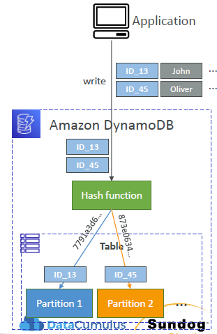

Para determinar a partição onde o dado será armazenado, o DynamoDB usa uma função de hash interna aplicada aos valores da Partition Key da tabela. Desse modo, é importante escolher uma Partition Key de alta cardinalidade para que os dados fiquem bem distribuidos e não ocorra problemas de **Hot Key** ou **Hot Partition**.

Para calcular o número de partições:

- nº partições por capacidade = (RCU_total / 3000) + (WCU_total / 1000);
- nº partições por tamanho = Total_size / 10 GB;
- nº partições = ceil(max(nº partições por capacidade, nº partições por tamanho))

O importante não é decorar a fórmula, mas saber que WCU e RCU são distribuídos uniformemente entre partições da tabelas.

Assim, se você tiver 10 partições na tabela e tiver provisionado 10 WCU e 10 RCU, cada partição terá 1 WCU e 1 RCU.

---

#### 5.6. Throttling

Se você exceder o RCU ou WCU, irá tomar um "ProvisionedThroughputExceededException".

Razões:

- Hot Keys: um partition key está sendo lido muitas vezes;
- Hot Partitions;
- Item muito grande (lembre, RCU e WCU dependem do tamanho do item).

Soluções:

- Exponential Backoff quando uma exceção é encontrada (já contamplado no SDK);
- Distribuir a partition key o máximo possível;
- Se for relacionado a RCU, podemos usar DynamoDB Accelerator (DAX).

---

#### 5.7. R/W Capacity Mode - On Demand

Leituras/ Escritas escalam automaticamente (scale up/down) com seus workloads.

Não é preciso planejar capacidade, WCU e RCU ilimitados.

Não ocorre throttle, mas é mais caro que o provisioned mode.

Você é cobrado por RRU (Read Request Units) e WRU (Write Request Units).

RRU = throughput para leitura (igual RCU).

On Demand é cerca de 2.5x mais caro que a capacidade provisionada e é útil para aplicações de tráfego imprevisível ou workloads desconhecidos.

**Escalonamento automático**

Modo sob demanda é flexível e capaz de servir centenas de solicitações por segundo sem planejamento de capacidade. Faz escalonamento automático adaptando-se ao volume de tráfego do aplicativo da seguinte forma:

- Se o padrão de tráfego do aplicativo varia entre 25.000 e 50.000 leituras fortemente consistentens por segundo, onde 50.000 leituras/segundo é o pico de tráfego superior, o modo de capacidade sob demanda instantaneamente acomoda tráfego para o dobro do pico superior (100.000 leituras por segundo);
- Se o aplicativo atingir tráfego de 100.000 leituras por segundo, esse se torna o novo pico superior, habilitando tráfego subsequente de até 200.000 leituras por segundo;
- Entretanto, pode ocorrer thottle error se você exceder o dobro de seu pico superior dentro de 30 minutos, que é o tempo que o DynamoDB leva para dobrar sua capacidade.

---

### 6. Dynamo DB Accelerator (DAX)

Serviço de armazenamento em cache compatível com Dynamo DB.

Não demanda nenhuma alteração na aplicação para utilização e resolve o problema de hot key na leitura.

Por padrão, tem configurado 5 minutos de TTL (cache) e suporta criptografia em repouso.

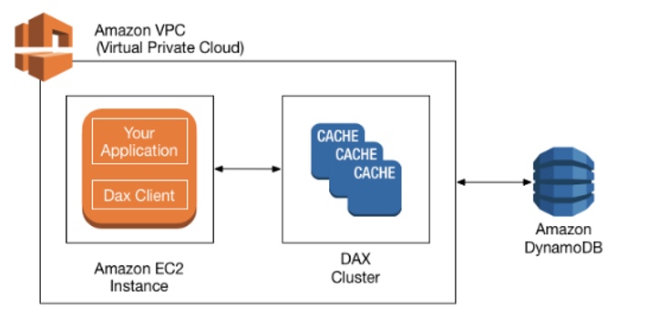

É possível provisionar um cluster de cache com mais de 10 nodes, sendo 3 nodes o mínimo recomendado para ambiente de produção, no formato de multi-AZ.

Em alguns cenários, vale mais a pena utilizar o ElastiCache ao invés do DAX, porém, é possível utilziar os dois juntos.

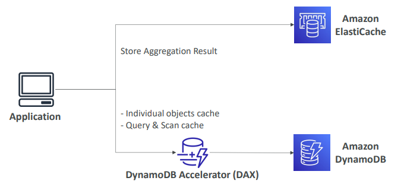

---

### 7. Dynamo DB Streams

Pode ser utilizado/habilitado para capturar eventos de modificação de dados em tabelas.

Os dados sobre esses eventos são exibidos no fluxo quase que em tempo real e na ordem em que os eventos ocorrem.

Cada evento é representado por um registro de streaming. Se você habilitar um fluxo em uma tabela, o Dynamo DB Streams gravará um registro de fluxo sempre que um dos seguintes eventos ocorrer:

* Inserção de um novo item: o streaming captura todo o item, com todos os atributos;
* Atualização de um item: o streaming captura o "antes" e o "depois" de todos os atributos modificados;
* Exclusão de um item: o streaming captura uma imagem de todo o item antes de ter sido excluído.

Cada registro de stream contém o nome da tabela, o timestamp do evento e outros metadados. Registros de stream tem um tempo de vida (TTL) de 24h, depois disso são removidos automaticamente.

Exemplo de aplicação: suponha que você tem uma tabela de clientes. Você pode gerar um stream sempre que um novo registro é inserido na tabela, acionar uma função lambda e enviar um e-mail de "boas-vindas".

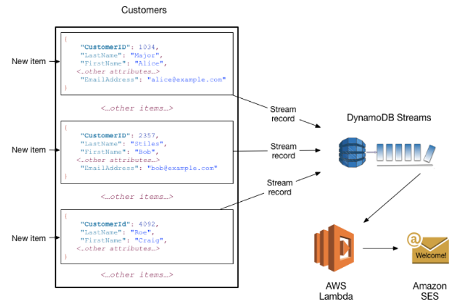

O Stream pode ser:

* Enviado a um Kinesis Data Stream;
* Lido por uma AWS Lambda;
* Lido por um Kinesis Client Library applications.

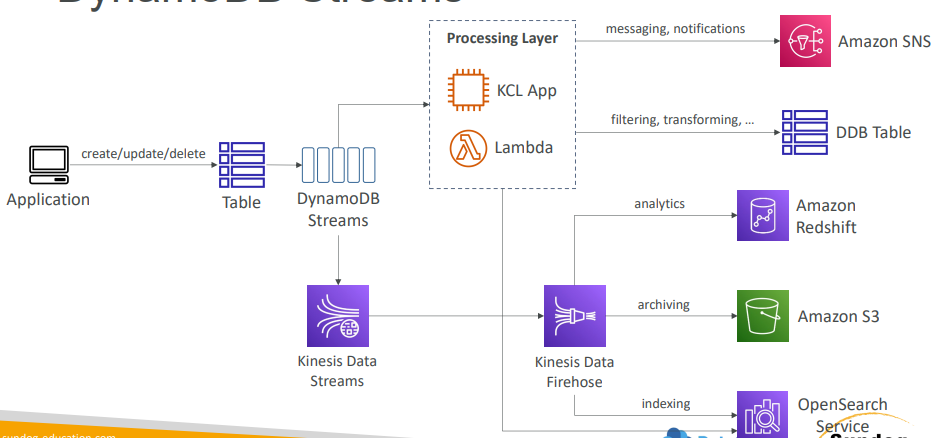

É possível escolher as informações que serão escritas no stream:

* KEYS_ONLY: apenas os atributos chave de um item modificado;
* NEW_IMAGE: o item inteiro, após a modificação;
* OLD_IMAGEM: o item inteiro, antes da modificação;
* NEW_AND_OLD_IMAGES: o item inteiro, antes e depois da modificação.

Dynamo DB Stream é feito de **shards**, como o Kinesis Data Stream, porém, os shards do Stream são gerenciados pela AWS.

> **Obs.:** os registros não são populados retroativamente em um stream, há apenas o registro de itens após a habilitação do Stream.

---

### 8. APIs do Dynamo DB

- Create Table: cria uma nova tabela
- DescribeTable: retorna as informações da tabela (esquema, PK, throughput, índices)
- ListTable: retorna o nome de todas as suas tabelas em uma lista
- UpdateTable: modifica as configurações de uma tabela ou de seus índices
- DeleteTable: remove uma tabela e seus objetos dependentes
- PutItem: grava um único item em uma tabela
- BatchWriteItem: grava até 25 itens em uma tabela
- GetItem: recupera um único item de uma tabela
- BatchGetItem: recupera até 100 itens de uma ou mais tabelas
-Query: recupera todos os itens que têm uma Partition Key específica
- Scan: recupera todos os itens na tabela ou no índice especificado
- UpdateItem: modifica um ou mais atributos em um item
- DeleteItem: exclui um único item de uma tabela
- BatchDeleteItem: exclui até 25 itens de uma ou mais tabelas
- ListStreams: retorna uma lista de todos os seus streams ou apenas do stream de uma tabela específica
- DescribeStream: retorna informações do stream (nome, ARN, ...)
- GetRecords: recupera um ou mais registros de stream

---
