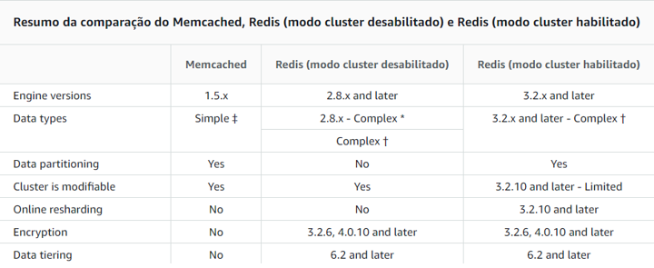
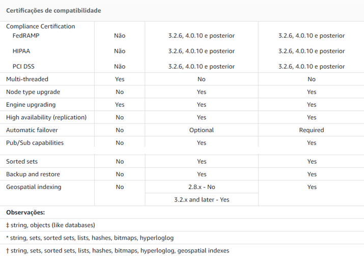
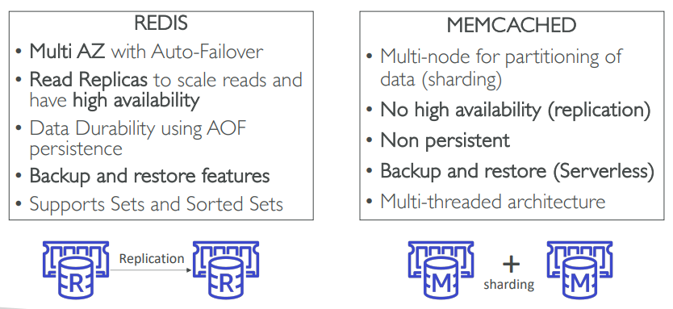
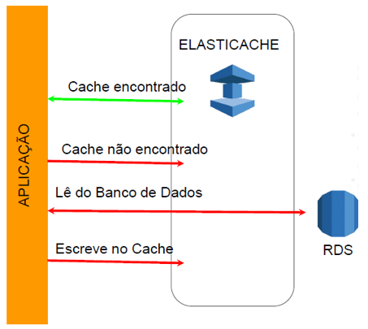

# ElastiCache

Banco de daods de chave-valor na memória. Possui alta velocidade.

Duas modalidades disponíveis: Memcached e Redis.

---

## Memcached

É ideal se você precisa do modelo mais simples possível, se precisar executar nós grandes com vários cores ou threads, se precisar da capacidade de expandir e reduzir, adicionar e remover nós à medida que a demanda no seu sistema aumenta e diminui ou se precisa de armazenar objetos em cache.

Se o Memcached for reiniciado, os dados da memória se perdem.

---

## Redis

Possui latência de milissegundos, Multi-AZ com Failover automático, suporta read replicas e serve para a maioria das aplicações.

