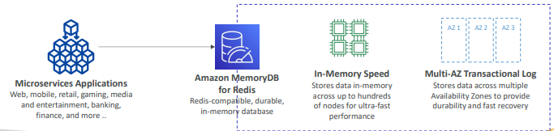

#  Estudos de AWS Memory DB

Estudos do AWS Memory DB.

> **Sumário**
>
> - [1. Introdução](#1-introdução)

---

## 1. Introdução

Banco de Dados NoSQL em memória compatível com `Redis`.

Oferece performance extremamente rápida com mais de 160 milhões de requisições por segundo.

Storage in-memory durável com Multi-AZ transactional log.

Escala de dezenas de GB para centenas de TB de storage.

Use cases: web e mobile apps, jogos online, media streaming, ...

---
