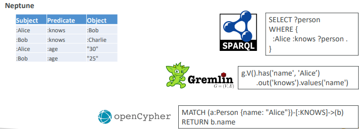

#  Estudos de Amazon Neptune

Estudos do Amazon Neptune.

> **Sumário**
>
> - [1. Introdução](#1-introdução)

---

## 1. Introdução

É um NoSQL Database para grafos totalmente gerenciado pela AWS.

Tem alta disponibilidade através de 3 AZs com até 15 réplicas de leitura.

Pode armazenar mais de bilhões de relacionamentos e consultar os grafos com latência de milissegundos.

É bom para grafos de conhecimento (wikipedia), detecção de fraudes, motores de recomendação, redes sociais, ...

Amazon Neptune suporta Graph Query Languages como Gremlin, openCypher, SPARQL.

---
