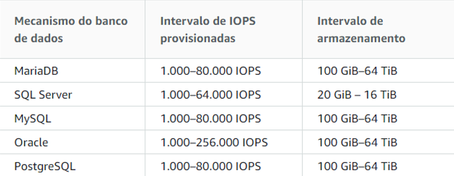
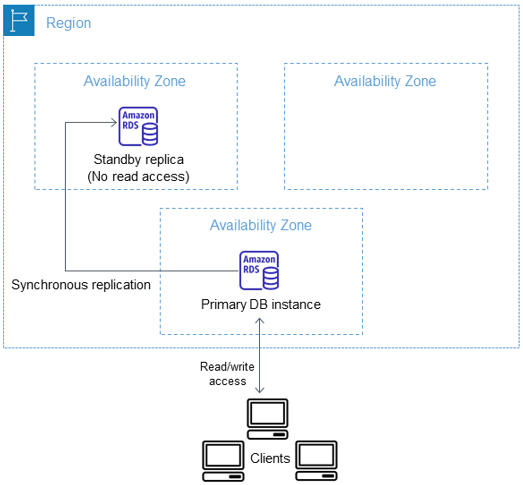
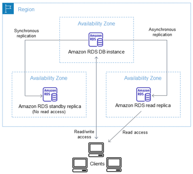
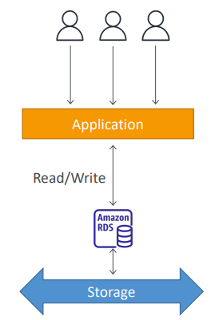
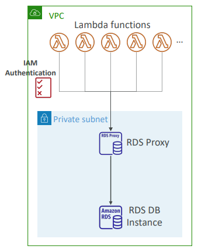

#  Estudos de AWS Relational Database (RDS)

Estudos do AWS RDS.

> **Sumário**
>
> - [1. Introdução](#1-introdução)
> - [2. Tipos de Classes de Instâncias](#2-tipos-de-classes-de-instâncias)
> - [3. Multi-AZ](#3-multi-az)
> - [4. Read Replica](#4-read-replica)
> - [5. Backup](#5-backup)
> - [6. Criptografia e Segurança](#6-criptografia-e-segurança)
> - [7. Outras informações](#7-outras-informações)
> - [8. Storage Auto Scaling](#8-storage-auto-scaling)
> - [9. RDS Custom](#9-rds-custom)

---

### 1. Introdução

Serviço para hospedagem de bancos de dados relacionais:

* Amazon Aurora (nativo AWS);
* MySQL;
* PostgreSQL;
* Maria DB;
* Oracle;
* SQL Server.

Não é recomendado para big data, mas para ambientes transacionais. Para big data, o mais indicado é o Redshift.

No RDS, é possível criar instâncias de bancos de dados e cada instância pode conter vários BDs. É possível ter até 40 instâncias de BDs no RDS, com as seguintes limitações:

* 10 de cada edição do SQL Server (Enterprise, Standart, Web e Express) no modelo "licença incluída";
* 10 para Oracle no modelo "licença incluída";
* 40 MySQL, Maria DB ou PostgreSQL;
* 40 Oracle no modelo "bring-your-own-licence" (BYOL).

O Amazon RDS cria uma conta de usuário principal (root) a sua instância de BD como parte do processo de criação.

RDS é **acid compliance**:

* Atomicidade;
* Consistência;
* Isolamento;
* Durabilidade.

O custo do RDS deriva de:

* Horas de instância de banco de dados com base na classe da instância (db.t2.small, db.m4.large);
* Armazenamento (GB por mês);
* Solicitações de E/S (por 1 milhão de solicitações por mês): aplicável apenas para armazenamento magnético;
* IOPs provisionadas (por IOPs por mês): aplicável apenas para armazenamento de IOPs provisionadas (SSD);
* Armazenamento de backup (GB/ mês): armazenamento associado aos backups automatizados do DB e a qualquer snapshot ativo que você tenha feito;
* Transferência de dados (GB): para dentro e para fora da instância de ou para a internet e outras Regions.

As modalidades de compra do RDS são:

* `On-demand`: pagamento por hora de instância de DB ligado;
* `Reserved`: reserva de uma instância de DB por um período de um ou três anos (com aplicação de desconto por longo prazo).

---

### 2. Tipos de Classes de Instâncias

O RDS suporta três tipos de classes de instâncias:

* Standert;
* Memory Optimized;
* Burstable Performance (expansível).

O Amazon RDS utiliza o EBS para armazenamento em log e banco de dados.

---

### 3. Multi-AZ

Recurso de replicação para disaster recovery, resiliência e alta disponibilidade.

Réplica é SYNC (DB de Standby `S` é sincronizado com o DB Master `M`).

Possui `Failover automático`: se o DB Master cair, o Standby assume (é promovido a Master) e o DNS do banco é mantido, dessa forma não é preciso ajustar a connection string nas aplicações.

DB Standby é mantido em uma AZ diferente da do Master.

Não é utilizado para `escalonamento`. O Standby `não é acessível`, ele é um DB de contingência, você não pode direcionar requisições para ele (não serve tráfego de leitura).

Instâncias Multi-AZ podem ter maior latência de gravação e confirmação em comparação com Single-AZ. Isso pode acontecer devido à replicação de dados síncrona.

Se você tiver uma instância de banco de dados em Single-AZ e modificá-la para Multi-AZ (para mecanismos diferentes do Amazon Aurora), o RDS criará um Snapshot da instância primária e fará a restauração do snapshot na AZ secundária. Em seguida, o RDS configurará a replicação síncrona entre as instâncias.

Quando ocorrer uma interrupção ou problema com a instância primária, o Failover ocorre entre 60 e 120 segundos. Também é possível forçar o failover manualmente reinicializando a instância primária.

---

### 4. Read Replica

Para utilizar, é preciso que o Backup esteja habilitado para o BD.

Limite de até 5 Read Replicas que podem estar na mesma AZ, em AZs diferentes ou até mesmo Regions diferentes.

Read Replica é utilizado para aumentar a performance de leituras. As requisições de leitura podem ser redirecionadas para as réplicas para reduzir a carga do DB Master.

Réplica é ASYNC (eventually consistence).

Se o Master cair, a Replica pode ser promovida a Master, mas diferentemente do Multi-AZ, o DNS não se mantém... é preciso ajustar a connection string nas aplicações.

É utilizado para escalonamento horizontal de leitura.

Em uma mesma instância, é possível habilitar Multi-AZ e Read Replica.

Para MySQL e Maria DB, é possível criar uma Read Replica para uma Read Replica (dois níveis de replicação). Obviamente, a latência entre Master e a segunda réplica é maior.

Amazon RDS não suporta replicação circular. Se o `DBInstance` replica para `ReadReplica1`, não é possível configurar o `ReadReplica1` para replicar de volta para o `DBInstance`.

Você pode excluir as réplicas de leitura a qualquer momento.

Se vocÊ excluir o DB Master sem excluir as suas réplicas de leitura na mesma região da AWS, cada réplica de leitura será promovida a uma instância de DB independente (se forem em Regions diferentes, é preciso checar algumas considerações na documentação da Amazon).

Você pode monitorar o atraso da replicação no CloudWatch visualizando a métrica `ReplicaLag` do RDS.

Instâncias de StandBy (Multi-AZ) e Replica (Read Replica) são cobradas da mesma forma que uma instância comum, dessa forma, a configuração da Replica, por exemplo, pode ser diferente da configuração do DB Master. Você pode ter um DB Master da família m6 e uma Replica da família m4 (capacidade menor).

---

### 5. Backup

* `Automated`: você habilita na criação do DB (ou posteriormente) e são criados backups automáticos do período de 1 a 35 dias. Você consegue restaurar o banco para um timestamp específico (**Restore Point-in-Time**).

* `Snapshot`: é manual. Ao excluir um DB, você pode criar um último snapshot dele.

Ao restaurar uma instância (com point-in-time ou snapshot) uma nova instância com endpoint diferente é criada.

Quando Multi-AZ está habilitado, backups e snapshots são feitos em cima do StanfBy DB para diminuir o impacto da geração dos backups.

Também é possível criar um snapshot a partir da Read Replica, porém, é preciso lembrar que a Replica é async.

---

### 6. Criptografia e Segurança

Possui criptografia em repouso com KMS e em trânsito com SSL.

Se você criar o DB sem criptografia habilitada e quiser criptografar depois, o procedimento é o seguinte:

* Criar um snapshot do DB atual;
* Restaurar o snapshot em um DB com criptografia habilitada;
* Remover o DB atual e ficar com o novo.

Não é possível simplesmente habilitar a criptografia depois que o DB foi criado.

AWS recomenda criar seus databases em redes privadas, não públicas.

---

### 7. Outras informações

* `Janelas de manutenção`: horário em que a AWS faz manutenções nas instâncias. Alguns itens podem deixar a instância offline na janela de manutenção e uma arquitetura Multi-AZ pode reduzir o impacto das manutenções;

* `Enhanced Monitoring`: ao habilitar, você tem acesso a mais de 50 métricas sobre o DB;

* Se quiser fazer upgrade de versão da engine do DB, você pode criar um Snapshot do DB atual, restaurar o snapshot para um novo DB com a nova engine, testar tudo na engine nova e excluir o DB antigo;

* Quando ocorre um failover o RDS emite um evento que pode acionar um SNS, Lambda, CloudWatch;

* Não é possível cancelar uma instância de banco de dados reservada.

---

### 8. Storage Auto Scaling

Te ajuda a aumentar o tamanho do storage da instância de DB dinamicamente.

RDS faz o scaling automático do storage quando detecta que você está consumindo mais storage do que o provisionado.

Você precisa configurar o `Maximum Storage Threshold`.

O storage é modificado automaticamente se:

* O free storage for menor que 10% do storage alocado;
* Low-storage dura pelo menos 5 minutos;
* 6 horas se passaram desde a última modificação.

---

### 9. RDS Custom

Para bancos de dados gerenciados Oracle e SQL Server.

Te permite acessar a infra do database (EC2) e o SO para fazer configurações, instalação de patches, habilitar features nativas e acessar as instâncias EC2 usando SSH ou SSM Session Manager.

---

### 10. Amazon RDS Proxy

Habilita aplicações para fazer pool e compartilhar DB connections estabelecidas com o database.

Aumenta a eficiência reduzindo o stress nos recursos do database (CPU, RAM) e minimiza a abertura de conexões (e timeout).

Serverless, autoscaling e tem alta disponibilidade (multi-AZ).

Reduz o failover time em até 66%.

Suporta RDS (MySQL, PostgreSQL, MariaDB, MS SQL Server) e Aurora.

Não necessista de mudanças no código da maioria das aplicações.

RDS Proxy nunca é publicamente acessível (deve ser acessado de uma VPC).

Força IAM Authentication para o database, e seguramente armazena as credenciais no AWS Secrets Manager.

