#  Estudos de Amazon Redshift

Estudos do Amazon Redshift.

> **Sumário**
>
> - [1. Introdução](#1-introdução)
> - [2. Arquitetura](#2-arquitetura)
>   - [2.1. Aplicativos Client](#21-aplicativos-client)
>   - [2.2. Clusters](#22-clusters)
>   - [2.3. Leader Node](#23-leader-node)
>   - [2.4. Compute Nodes](#24-compute-nodes)
>   - [2.5. Redshift Management Storage](#25-redshift-management-storage)
>   - [2.6. Node Slices](#26-node-slices)
> - [3. Redshift Spectrum](#3-redshift-spectrum)
> - [4. Performance](#4-performance)
>   - [4.1. Massively Parallel Processing (MPP)](#41-massively-parallel-processing-mpp)
>   - [4.2. Columnar Data Storage](#42-columnar-data-storage)
>   - [4.3. Column Compression](#43-column-compression)
>   - [4.4. Otimizador de Consultas](#44-otimizador-de-consultas)
>   - [4.5. Armazenamento em Cache dos Resultados](#45-armazenamento-em-cache-dos-resultados)
> - [5. Gerenciamento do Workload](#5-gerenciamento-do-workload)
> - [6. Distribuição de Dados](#6-distribuição-de-dados)
>   - [6.1. Auto](#61-distribuição-auto)
>   - [6.2. Even](#62-distribuição-even)
>   - [6.3. Key](#63-distribuição-key)
>   - [6.4. All](#64-distribuição-all)
>   - [6.5. Designação de Estilos de Distribuição](#65-designação-de-estilos-de-distribuição)
> - [7. Carregamento de Dados](#7-carregamento-de-dados)
>   - [7.1. Copy Command](#71-copy-command)
>   - [7.2. Insert Command](#72-insert-command)
>   - [7.3. Carregamento por ordem de Sort Key](#73-carregamento-por-ordem-de-sort-key)
>   - [7.4. Carregamento em Blocos Sequenciais](#74-carregamento-em-blocos-sequenciais)
>   - [7.5. Narrow Tables](#75-narrow-tables)
> - [8. Descarregamento de Dados](#8-descarregamento-de-dados)
> - [9. Tabelas e Views do Sistema](#9-tabelas-e-views-de-sistema)
> - [10. Vacuum](#10-vacuum)
> - [11. Outros](#11-outros)
>   - [11.1. DB Link](#111-db-link)
>   - [11.2. Federated Queries](#112-federated-queries)

---

## 1. Introdução

Data Warehouse totalmente gerenciado pela AWS com escala de petabytes.

É cerca de 10x mais rápido que outros DWs (via machine learning, massively parallel query execution e storage colunar).

Desenhado para OLAP, não OLTP.

Possui interfaces SQL, ODBC e JDBC.

Faz scale up/down sob demanda, tem funções de bacukp e replicação e monitoração via CloudWatch/ CloudTrail.

Use cases:

* Acelerar workloads de analytics;
* Unificar o Data Warehouse com o Data Lake;
* Modernizar o DW;
* etc.

O tempo em que o DW fica ocioso não é cobrado, portanto, você paga apenas pelo que usa.

**Durabilidade**

Redshift faz replicação dentro do cluster, backup no S3 de forma assíncrona em outra região, snapshots automáticos, em caso de falha, os nodes são automaticamente repostos, porém, é limitado a uma AZ. Multi-AZ apenas para RA3 Cluster.

**Scaling**

Suporta escalonamento vertical e horizontal.

Durante o scaling:

* Um novo cluster é criado enquanto o antigo permanece disponível para leituras;
* `CNAME` é trocado para o novo cluster (downtime de alguns minutos);
* Dados são movidos em paralelo aos novos compute nodes.

---

## 2. Arquitetura

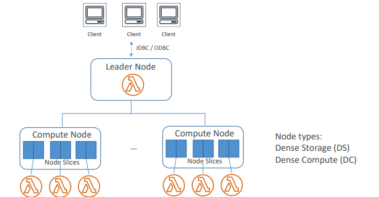

O Redshift é composto por um cluster formado por um `leader node` e `compute nodes`.

Você pode ter de 1 a 128 compute nodes, dependendo do tipo de nó, portanto, não é infinitamente dimensionável.

Cada cluster, pode conter um ou mais bancos de dados. Os dados são armazenados nos compute nodes.

Dentro dos compute nodes temos `node slices`, que são "fatias" (partições) e uma parte da memória e do disco no compute node será alocada para cada node slice, onde ela processa uma parte da carga de trabalho a esse nó.

O número de slices por node é determinado pelo tamanho do nó do cluster.

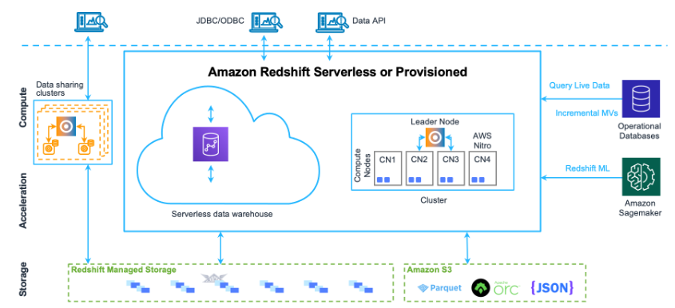

---

### 2.1. Aplicativos Client

O Redshift se integra a diversas ferramentas de ETL, BI e Analíticas. Ele se baseia no PostgreSQL open source, portanto, a maioria das aplicações SQL existentes funcionará no Redshift com alterações mínimas.

---

### 2.2. Clusters

Um cluster é composto de um ou mais `compute nodes`. Se um cluster for provisionado com dois ou mais `compute nodes`, um `leader node` adicional coordenará os nós de computação e processará a comunicação externa. O aplicativo client interage diretamente com o leader node. Os nós de computação são transparentes a aplicativos externos.

---

### 2.3. Leader node

O leader node gerencia a comunicação com programas cliente e toda a comunicação com compute nodes. Ele analisa e desenvolve `planos de execução` para realizar operações de banco de dados. Com base no plano de execução, o leader node compila o código, distribui o código compilado aos nós de computação e atribui uma parte dos dados a cada nó de computação.

O leader node distribui instruções SQL para os nós de computação somente quando uma consulta referencia tabelas armazenadas nos nós de computação. Todas as outras consultas são executadas de maneira exclusiva no leader node.

---

### 2.4. Compute nodes

Os nós de computação executam o código compilado e reenviam os resultados intermediários ao leader node para agregação final.

Cada compute node tem as próprias CPI e memória dedicadas, determinadas pelo tipo de nó. À medida que sua workload cresce, você pode aumentar a capacidade computacional de um cluster aumentando o número de nós, atualizando o tipo de nó ou ambos.

**RA3 nodes**:

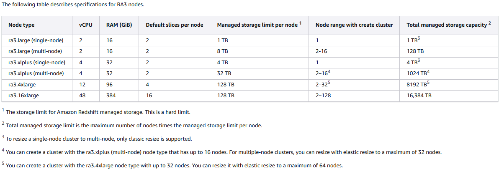

**Dense Compute nodes (DC2)**: para computação intensiva

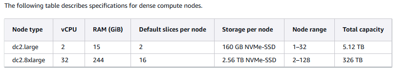

---

### 2.5. Redshift Management Storage

Os dados do data warehouse são armazenados em outro nível de armazenamento do Redshift Managed Storage (RMS). O RMS oferece a capacidade de escalar seu armazenamento para petabytes usando o armazenamento do Amazon S3.

---

### 2.6. Node Slices

Um compute node é particionado em fatias. Cada fatia recebe uma parte da memória do nó e do espaço em disco, em que processa uma parte do workload atribuído ao nó. O leader node gerencia dados e a distribuição de dados para as fatias e divide o workload para todas as consultas ou outras operações de banco de dados para as fatias. Assim, as fatias funcionam em paralelo para completar a operação.

O número de fatias por nó é determinado pelo tamanho do nó do cluster.

---

## 3. Redshift Spectrum

Te permite consultar exabytes de dados não estruturados no S3 sem fazer a carga deles no Redshift (a mesma ideia do Athena), porém, no Redshift Spectrum o dado aparece como se fosse uma tabela do Redshift.

Permite concorrência limitada, escalonamento horizontal e te permite separar os recursos de storage dos de computação, permitindo dimensionar cada um deles independentemente.

Spectrum é compatível com vários formatos de dados (AVRO, CSV, Grok, ION, JSON, ORC, Parquet, etc).

Também suporta compressão Gzip e Snappy.

O Amazon Redshift Spectrum reside em servidores dedicados do Redshift, que são independentes do seu cluster.

Todas as tabelas externas devem ser criadas em um esquema externo, o qual você cria usando a instrução `CREATE EXTERNAL SCHEMA`.

Um esquema externo do Redshift faz referência a um banco de dados externo em um catálogo de dados externo. Você pode criar o banco de dados externo no Amazon Redshift, no Amazon Athena, no AWS Glue Data Catalog ou em um metastore do Apache Hive, como o Amazon EMR.

**Limitações**

* O cluster do Redshift e o bucket S3 precisam estar na mesma região;
* Não é possível realizar operações de atualização ou exclusão em tabelas externas.

---

## 4. Performance

### 4.1. Massively Parallel Processing (MPP)

As cargas de trabalho são distribuídas automaticamente entre todos os nós, e a adição de nós ao DW é facilitada e também permite um desempenho mais rápido das conslutas a medida que o DW cresce.

O Amazon Redshift distribui as linhas de uma tabela para os nós de computação para que os dados possam ser processados em paralelo.

---

### 4.2. Columnar Data Storage

Dados organizados por coluna, o que te permite economizar largura de banda e outras recursos ao fazer análises sobre colunas específicas.

A coluna ou os dados são armazenados sequencialmente na mídia de armazenamento e exigem muito menos E/S, melhorando o desempenho da consulta.

Ao usar column storage, cada bloco de dados armazena valores de uma única coluna de várias linhas.

Exemplo de como os registros de tabelas de bancos de dados normalmente são armazenados em blocos de disco por linha:

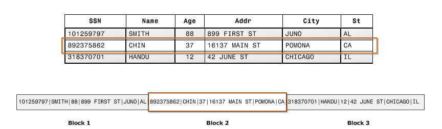

Se o tamanho do bloco for menor que o tamanho de um registro, o armazenamento de um registro inteiro poderá usar mais de um bloco. Se o tamanho do bloco for maior que o tamanho de um registro, o armazenamento de um registro inteiro poderá usar menos de um bloco, resultando em um uso ineficiente do espaço em disco.

Exemplo de armazenamento colunar:

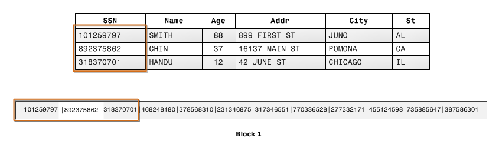

Usando armazenamento colunar, cada bloco de dados armazena valores de uma única coluna de várias linhas. Conforme os registros entram no sistema, o Amazon Redshift converte de forma transparente os dados em armazenamento colunar para cada uma das colunas.

Uma vantagem adicional é que, como cada bloco contém o mesmo tipo de dados, os dados do bloco podem usar um esquema de compactação selecionado especificamente para o tipo de dados da coluna, reduzindo ainda mais o espaço em disco e E/S.

O Redshift usa um tamanho de bloco de 1 MB, o que é mais eficiente e reduz ainda mais o número de solicitações de E/S.

---

### 4.3. Column Compression

Geralmente, a compressão em colunas fornece uma compactação muito mais alta que a compressão em linhas.

Assim, não são necessários índices ou views materializadas com o Redshift. Ele também utiliza menos espaço que os bancos de dados relacionais.

O `Redshift Spectrum` é compatível com os seguintes tipos de compactação:

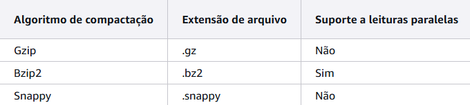

A compactação é uma operação em nível de coluna que reduz o tamanho dos dados quando eles são armazenados. A compactação economiza espaço de armazenamento e reduz o tamanho dos dados que são lidos a partir do armazenamento, que reduz a quantidade de E/S de disco e, portanto, melhora a performance da consulta.

`ENCODE AUTO` é o padrão para tabelas. Quando a tabela é definida como `ENCODE AUTO`, o Redshift gerencia automaticamente a codificação de compactação para todas as colunas da tabela.

Porém, se você especificar a codificação de compactação para qualquer coluna, a tabela não será mais definida como `ENCODE AUTO`.

Criação da tabela `product` com uma coluna compactada e outra não:

```sql
create table product(
product_id int encode raw,
product_name char(20) encode bytedict);
```

É possível especificar a codificação de uma coluna que é adicionada posteriormente com o comando `ALTER`:

```sql
ALTER TABLE table-name ADD [ COLUMN ] column_name column_type ENCODE encoding-type
```

Ao usar `AUTO ENCODE`, o Redshift fará a compactação da seguinte forma:

* Colunas que são definidas como `SORT KEY` são designadas a compactação `RAW`;
* Colunas definidas como tipos de dados `SMALLINT`, `INTEGER`, `BIGINT`, `DECIMAL`, `DATE`, `TIMESTAMP` ou `TIMESTAMPZ` recebem a compactação `AZ64`;
* Colunas definidas como tipos de dados `CHAR` ou `VARCHAR` recebem a compactação `LZO`.

> **Codificação `RAW`**
>
> É a codificação padrão para sort keys e colunas definidas como `BOOLEAN`, `REAL` ou `DOUBLE PRECISION`. Com a codificação raw, os dados são armazenados em formato bruto, descompactado.

> **Codificação `AZ64`**
>
> Algoritmo proprietário da Amazon para atingir alta taxa de compactação e processamento de consulta aprimorado.

> **Codificação `LZO`**
>
> Funciona bem para `CHAR` e `VARCHAR`, para texto de formato livre, tais como descrições de produto, comentários de usuários ou strings `JSON`.

---

### 4.4. Otimizador de Consultas

O mecanismo de execução de consultas do Amazon Redshift incorpora um otimizador de consultas com reconhecimento de MPP e também aproveita o armazenamento de dados orientado por colunas. O otimizador de consulta implementa melhorias e extensões significativas para o processamento de consultas analíticas complexas que geralmente incluem junções de várias tabelas, subconsultas e agregação.

---

### 4.5. Armazenamento em cache dos resultados

Para reduzir o tempo de execução da consulta e melhorar a performance do sistema, o Amazon Redshift armazena em cache os resultados de certos tipos de consultas na memória do leader node. Quando o usuário envia uma consulta, o Redshift verifica o cache de resultados em busca de uma cópia em cache válida dos resultados da consulta. Se for encontrada uma correspondência no cache, os resultados armazenados em cache serão usados e não será executada a consulta. O cache é transparente para o usuário.

O armazenamento em cache é ativado por padrão. Para desativar, defina o parâmetro `enable_result_cache_for_session` como `off`.

O Redshift usa resultados em cache para uma nova consulta quando todas as seguites opções são verdadeiras:

* O usuário que envia a consulta possui permissão de acesso aos objetos usados na consulta;
* A tabela ou as exibições na consulta não foram modificadas;
* A consulta não usa uma função que precisa ser avaliada cada vez que ela é executada, por exemplo, `GETDATE`;
* A consulta não faz referência a tabelas externas do Amazon Redshift Spectrum;
* Os parâmetros de configuração que podem afetar os resultados da consulta estão inalterados;
* A consulta coincide sintaticamente com a consulta armazenada em cache.

Para maximizar a eficácia do cache e da utilização dos recursos, o Redshift não armazena em cache alguns conjuntos grandes de resultados de consultas. O Redshift determina se os resultados serão ou não armazenados em cache. Esses fatores incluem o número de entradas no cache e o tipo de instância do seu cluster.

Para determinar se uma consulta usou o cache de resultados, basta acessar a view `SVL_QLOG`. Se uma consulta utilizar o cache de resultados, a coluna `source_query` retornará o ID da consulta de origem.

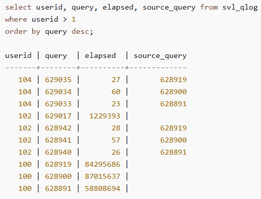

---

## 5. Gerenciamento do Workload

O Workload Management (WLM) do Redshift permite prioridades de gerenciamento flexível dentro dos workloads para que consultas curtas e de execução rápida não fiquem presas em filas atrás de consultas de longa duração. O Redshift cria filas de consulta no runtime de acorda com as classes de serviço, que definem os parâmetros de configuração para vários tipos de filas, incluindo filas internas do sistema e filas acessíveis ao usuário.

O Redshift oferece o gerenciamento de workload automático, chamado de `WLM Automático`, que é ajustado para lidar com workloads variáveis e é o padrão recomendado. Com o WLM automático, o Redshift determina a utilização dos recursos à medida que as consultas chegam e estabelece dinamicamente se elas devem ser executadas no cluster principal, em um cluster com escalabilidade monetária ou se devem ser enviadas para uma fila. Quando as consultas são enfileiradas, o WLM automático prioriza as consultas de menor duração.

---

## 6. Distribuição de Dados

Quando você carrega dados em uma tabela, o Redshift distribui as linhas da tabela para cada um dos compute nodes de acordo com o estilo de distribuição da tabela.

Quando você executa uma consulta, o otimizador de consulta redistribui as linhas aos nós de computação conforme necessário para executar junções e agregações.

O objetivo de escolher um estilo de distribuição de tabela é minimizar o impacto da etapa de redistribuição ao localizar os dados onde eles precisam estar antes que a consulta seja executada.

> `DISTSTYLE_AUTO`
>
> Ao utilizar, o Redshift usará a otimização automática de tabela para escolher o estilo de distribuição de dados.

A distribuição de dados tem duas metas principais:

* Distribuir uniformemente o workload entre os nós no cluster, pois a distribuição desigual força alguns nós a trabalhar mais do que outros, afetando a performance da consulta;
* Minimizar a movimentação de dados conforme uma consulta é executada, pois se as linhas que participam de junções ou agregações já estão colocadas nos nós com suas linhas de junção em outras tabelas, o otimizador não precisa redistribuir tanto os dados quando as consultas são executadas.

Para consultar o estilo de distribuição de uma tabela, consulte `PG_CLASS_INFO` ou `SVV_TABLE_INFO`.

---

### 6.1. Distribuição `AUTO`

O Redshift atribui um estilo de distribuição ideal com base no tamanho dos dados da tabela. Por exemplo, se o estilo de distribuição `AUTO` for especificado, o Redshift inicialmente vai atribuir o estilo de distribuição `ALL` a uma tabela pequena.

Quando a tabela crescer, o Redshift poderá alterar o estilo de distribuição para `KEY`, escolhendo a chave primária (ou uma coluna de chave primária composta) como chave de distribuição.

Se a tabela crescer e nenhuma das colunas for adequada para ser a chave de distribuição, o Redshift vai alterar o estilo para `EVEN`.

A mudança no estilo de distribuição ocorre em segundo plano com impacto mínimo nas consultas do usuário.

Para visualizar ações que o Amazon Redshift executou automaticamente para alterar uma chave de distribuição de tabela, consulte a `SVL_AUTO_WORKER_ACTION`. Para exibir as recomendações atuais sobre a alteração de uma chave de distribuição, consulte `SVV_ALTER_TABLE_RECOMMENDATIONS`.

---

### 6.2. Distribuição `EVEN`

O leader node distribui as linhas ao longo dos slices de modo *round-robin* (distribuição equitativa de dados), independente dos valores de qualquer coluna específica. A distribuição `EVEN` é apropriada quando uma tabela não participa de junções. Também é apropriado quando não há uma opção clara entre a distribuição `KEY` e `ALL`.

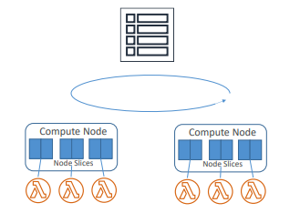

---

### 6.3. Distribuição `KEY`

As linhas são distribuídas de acordo com os valores em uma coluna. O nó lider coloca os valores correspondentes na mesma node slice. Se você distribuir um par de tabelas nas chaves de união, o nó lider coloca as linhas nas fatias de acordo com os valores nas colunas de união. Dessa forma, os valores correspondentes das colunas comuns são armazenados fisicamente juntos.

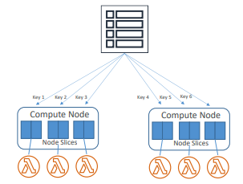

---

### 6.4. Distribuição `ALL`

Uma cópia de toda a tabela é distribuída para cada nó. Onde a distribuição `EVEN` ou a distribuição `KEY` coloca apenas uma porção das linhas da tabela em cada nó, a distribuição `ALL` garante que todas as linhas sejam dispostas para cada junção na qual a tabela participa.

A distribuição `ALL` multiplica o armazenamento exigido pelo número de nós no cluster e, portanto, ela demora muito mais tempo para carregar, atualizar ou inserir dados em várias tabelas.

A distribuição `ALL` é apropriada somente para tabelas relativamente lentas, ou seja, tabelas que não são frequentemente ou extensivamente atualizadas.

Como o custo de redistribuir tabelas pequenas durante uma consulta é baixo, não há um benfício significativo em definir tabelas de pequema dimensão como `DISTSTYLE ALL`

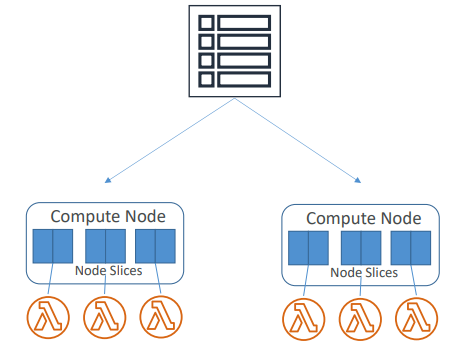

---

### 6.5. Designação de Estilos de Distribuição

Instruções baseadas em um star schema, porém, o Redshift foi projetado para funcionar de maneira eficaz com qualquer projeto de esquema, os princípios são aplicáveis a qualquer schema.

1. **Especifique a chave primária e chaves estrangeiras para todas as suas tabelas.**

O Redshift não impõe restrições de chave primária e chave estrangeira, mas o otimizador de consulta as usa ao gerar planos de consulta. Se você definir chaves primárias e estrangeiras, seu aplicativo deverá manter a validade das chaves.

2. **Distribua a tabela de fatos e sua maior tabela de dimensões em suas colunas comuns.**

Escolha a maior dimensão com base no tamanho do conjunto de dados que participa da junção mais comum, não apenas no tamanho da tabela. Se uma tabela é geralmente filtrada usando uma cláusula `WHERE`, somente uma porção de suas linhas participam da junção.

Tal tabela tem menor impacto na redistribuição do que uma tabela menor que contribua com mais dados. Desenhe a chave primária da tabela de dimensões e a chave estrangeira correspondente da tabela de fatos como `DISTKEY`.

Se várias tabelas usarem a mesma chave de distribuição, elas também serão colocadas com a tabela de fatos.

Sua tabela de fatos pode ter apenas uma chave de distribuição. Quaisquer tabelas que se juntam em outra chave não são colocadas com a tabela de fatos.

3. **Desenhe as chaves de distribuição para as outras tabelas de dimensão.**

Distribua as tabelas em suas chaves primárias ou em suas chaves estrangeiras, dependendo de como elas geralmente se juntam com outras tabelas.

4. **Avalie a necessidade de alterar algumas das tabelas de dimensões para usar a distribuição `ALL`**

Se uma tabela de dimensão não pode ser disposta com a tabela de fato ou outras tabelas de junção importantes, você pode melhorar a performance da consulta significativamente ao distribuir toda a tabela para todos os nós.

O uso da distribuição `ALL` multiplica as exigÊncias de espaço de armazenamento e aumenta os tempos de carregamento e operações de manutenção, portanto você deve considerar todos os fatores antes de optar pela distribuição `ALL`.

5. **Use a distribuição `AUTO` para as tabelas restantes.**

Se uma tabela for amplamente desnormalizada e não participar de junções, ou se você não tiver uma opção clara de outro estilo de distribuição, use a distribuição `AUTO`.

---

## 7. Carregamento de Dados

Há algumas maneiras de carregar dados em um banco de dados no Amazon Redshift:

### 7.1. `COPY` command

Executa uma ingestão de arquivos em lote a partir do S3, EMR, Dynamo DB ou outras origens remotas. Esse método utiliza processamento paralelo do Redshift, permitindo o carregamento de grandes quantidades de dados de forma muito mais eficiente do que instruções de `INSERT`.

`COPY` consegue descriptografar dados.

Suporta `gzip`, `lzop` e `bzip2` compression e faz compressão automática (option) através de análise dos dados que estão sendo carregados para uma compressão ótima de schema.

Ao carregar dados com o comando `COPY`, o Redshift carrega todos os arquivos referenciados pelo prefixo do bucket do Amazon S3. Se o prefixo se referir a vários arquivos ou arquivos que podem ser divididos, o Redshift carregará os dados paralelamente, aproveitando a arquitetura MPP. Isso divide o workload entre os nós do cluster. Por outro lado, quando você carrega dados de um arquivo que não pode ser dividido, o Redshift é forçado a executar um carregamento serializado, que é muito mais lento.

**Carregar dados de arquivos que podem ser divididos**

Os seguintes arquivos podem ser divididos automaticamente quando seus dados são carregados:

* Um arquivo CSV não compactado;
* Um arquivo em colunas (Parquet/ORC).

O Amazon Redshift divide automaticamente arquivos de 128 MB ou maiores em partes. Arquivos em colunas, especificamente Parquet e ORC, não serão divididos se tiverem menos de 128 MB. O Redshift usa slices trabalhando em paralelo para carregar os dados.

**Carregar dados de arquivos que não podem ser divididos**

Tipos de arquivo, como JSON ou CSV, quando compactados com outros algorítmos de compactação, como GZIP, não são divididos automaticamente. Desse modo, é recomendado dividir os dados manualmente em vários arquivos menores com tamanho semelhante, de 1 MB a 1 GB, após a compactação. Além disso, também é ideal que o número de arquivos seja um múltiplo do número de slices no cluster.

> **STL_LOAD_COMMITS**
>
> Você pode consultar a tabela de sistema `stl_load_commits` para verificar se os arquivos foram carregados com sucesso com o comando `COPY`.

Exemplo:

```sql
-- verificacao de carga na tabela TICKIT

SELECT query, trim(filename) AS filename, curtime, status
FROM stl_load_commits
WHERE filename like '%tickit%' order by query;
```

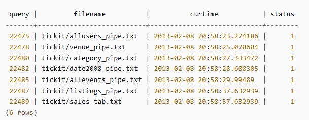

Para validar os arquivos de dados antes de realmente carregar os dados, use a opção `NOLOAD` com o comando `COPY`. O Amazon Redshift analisa o arquivo de entrada e exibe todos os erros que ocorrem.

O exemplo a seguir usa a opção `NOLOAD` e nenhuma linha é realmente carregada na tabela.

```sql
COPY public.zipcode1
FROM 's3://amzn-s3-demo-bucket/mydata/zipcode.csv' 
DELIMITER ';' 
IGNOREHEADER 1 REGION 'us-east-1'
NOLOAD
CREDENTIALS 'aws_iam_role=arn:aws:iam::123456789012:role/myRedshiftRole';
```

retorno:
```
Warnings:
Load into table 'zipcode1' completed, 0 record(s) loaded successfully.  
```

---

### 7.2. `INSERT` command

Se o dado a ser carregado já está em outra tabela do Redshift, utiliza-se o comando `insert` para fazer a carga dos dados.

Por questão de performance, é indicado fazer o insert de dados em uma única instrução ao invés de várias instruções, por exemplo:

Fazendo a carga de 3 registros na tabela `produto_novo`.
```sql
-- Fazer assim
insert into produto (nome, valor) values
('celular', 1.500),
('notebook', 3.000),
('televisao', 1.800);

-- Nao fazer assim
insert into produto (nome, valor) values ('celular', 1.500);
insert into produto (nome, valor) values ('notebook', 3.000);
insert into produto (nome, valor) values ('televisao', 1.800);
```

Para inserção de dados em massa, é possível usar tanto `INSERT...SELECT` quanto `CREATE TABLE ... AS`

Por exemplo, para fazer a inserção de todas as linhas da tabela `category` na tabela `category_stage`.

```sql
insert into category_stage
(select * from category);

-- ou

create table category_stage as
select * from category;
```

---

### 7.3. Carregamento por ordem de sort key

É recomendado carregar os dados por ordem de chave de classificação para evitar a necessidade de vacuum.

Se cada lote de novos dados seguir as linhas existentes na tabela, seus dados serão adequadamente armazenados por ordem de classificação e você não precisará executar um vacuum.

Você não precisa pré-classificar as linhas em cada carregamento, pois `COPY` classifica cada lote de dados de entrada durante o carregamento.

Por exemplo, suponha que você carregue dados diariamente com base nas atividades do dia atual. Se sua chave de classificação for uma coluna de *timestamp*, seus dados serão armazenados na ordem de classificação. Essa ordem ocorre, pois os dados do dia atual são sempre anexados no final dos dados do dia anterior.

---

### 7.4. Carregamento em blocos sequenciais

Se você precisar adicionar uma grande quantidade de dados, carregue-os em blocos sequenciais de acordo com a ordem de classificação e elimine a necessidade de vacuum.

Por exemplo, suponha que você precise carregar uma tabela com eventos de janeiro de 2017 a dezembro de 2017. Supondo que cada mês está em um arquivo, carregue as linhas para janeiro, fevereiro e assim por diante. Sua tabela será completamente classificada quando seu carregamento for concluído e você não precisará executar um vacuum.

Ao carregar conjuntos de dados muito grandes, o espaço necessário para classificar pode exceder o espaço total disponível. Ao carregar dados em blocos menores, você usará muito menos espaço intermediário de classificação durante cada carregamento.

Além disso, o carregamento em blocos menores facilita a reinicialização se o comando `COPY` falhar e for revertido.

---

### 7.5. Narrow Tables

São tabelas com muito poucas colunas, mas com um número muito grande de linhas. Para esses casos, as três colunas de identidade de metadados ocultas (`INSERT_XID`, `DELETE_XID`, `ROW_ID`) consumirão uma quantidade desproporcional de espaço em disco para a tabela.

Para otimizar a compactação das colunas ocultas, carrega a tabela em uma única transação `COPY` sempre que possível. Se você carregar a tabela com vários comandos `COPY` distintos, a coluna `INSERT_XID` não será bem compactada.

Você deverá realizar uma operação de limpeza se usar vários comandos COPY, mas isso não melhorará a compactação de INSERT_XID.

---

## 8. Descarregamento de Dados

Para descarregar dados de tabelas para um conjunto de arquivos em um bucket do Amazon S3, você pode usar o comando `UNLOAD` com uma instrução `SELECT`.

O descarregamento também ocorre de forma paralela, gerando um ou mais arquivos por slice node.

Você pode especificar que o UNLOAD deve gravar os resultados em série para um ou mais arquivos adicionando a opção `PARALLEL OFF`.

Você pode limitar o tamanho dos arquivos no S3 especificando o parâmetro `MAXFILESIZE`. Exemplo:

```sql
-- criando arquivos de 100 MB

unload ('select * from venue')
to 's3://amzn-s3-demo-bucket/tickit/unload/venue_' 
iam_role 'arn:aws:iam::0123456789012:role/MyRedshiftRole'
parallel off
maxfilesize 100 mb;
```

O UNLOAD criptografa automaticamente os arquivos de dados usando a criptografia do lado do servidor do Amazon S3 (SSE-S3).

Você pode usar qualquer instrução `SELECT` no UNLOAD, exceto com o uso de `LIMIT`.

Exemplo:

```sql
unload ('select * from venue where year(date) = 2025')   
to 's3://amzn-s3-demo-bucket/tickit/unload/venue_' 
iam_role 'arn:aws:iam::0123456789012:role/MyRedshiftRole';
```

No exemplo anterior, os arquivos serão gerados com o prefixo `venue_`.

```
venue_0000_part_00
venue_0001_part_00
venue_0002_part_00
venue_0003_part_00
```

Por padrão, UNLOAD grava dados em paralelo a vários arquivos, de acordo com o número de slices no cluster. Para gravar dados em um único arquivo, especifique a `PARALLEL OFF`. O tamanho máximo de um arquivo de dados é 6,2 GB. Se o tamanho dos dados for maior, o UNLOAD cria´ra arquivos adicionais de até 6,2 GB.

Para sobrescrever os arquivos no bucket target, é preciso especificar `ALLOWOVERWRITE`:

```sql
unload ('select * from venue') 
to 's3://amzn-s3-demo-bucket/venue_pipe_' 
iam_role 'arn:aws:iam::0123456789012:role/MyRedshiftRole'
manifest 
allowoverwrite;
```

Para descarregar dados no Amazon S3 usando uma chave KMS, é preciso usar o parâmetro `KMS_KEY_ID`:

```sql
unload ('select venuename, venuecity from venue')
to 's3://amzn-s3-demo-bucket/encrypted/venue_' 
iam_role 'arn:aws:iam::0123456789012:role/MyRedshiftRole'
KMS_KEY_ID '1234abcd-12ab-34cd-56ef-1234567890ab'
encrypted;
```

Por default, o delimitador dos dados é o pipe ("|"), porém, é possível definir outro delimitador ou gerar os dados com largura fixa:

```sql
-- definindo o delimitador

unload ('select * from venue')
to 's3://amzn-s3-demo-bucket/tickit/venue/comma' 
iam_role 'arn:aws:iam::0123456789012:role/MyRedshiftRole'
delimiter ',';

-- largura fixa

unload ('select * from venue')
to 's3://amzn-s3-demo-bucket/tickit/venue/fw' 
iam_role 'arn:aws:iam::0123456789012:role/MyRedshiftRole'
fixedwidth '0:3,1:100,2:30,3:2,4:6';
```

Exemplo dos dados gerados com largura fixa

```
20 Air Canada Centre         Toronto      ON0
60 Rexall Place              Edmonton     AB0
100U.S. Cellular Field       Chicago      IL40615
200Al Hirschfeld Theatre     New York CityNY0
240San Jose Repertory TheatreSan Jose     CA0
300Kennedy Center Opera HouseWashington   DC0
```

---

## 9. Tabelas e Views de Sistema

Há vários tipos de tabelas e visões do sistema:

* As visualizações `SVV` contém informações sobre objetos de banco de dados como referências as tabelas `STV` transitórias;
* As visualizações `SYS` são usadas para monitorar o uso de consultas e workload para cluster e grupos de trabalho sem servidor;
* As tabelas `STL` são geradas a partir de logs que foram mantidos em disco para apresentar um histórico do sistema;
* Tabelas de `STV` são tabelas virtuais do sistema que contém snapshots dos dados atuais do sistema. Elas se baseiam em dados transitórios na memória e não são mantidas em logs baseados em disco ou em tabelas regulares;
* As visões `SVCS` fornecem detalhes sobre consultas nos cluster principal e de escalabilidade da simultaneidade;
* As visualizações `SVL` fornecem detalhes sobre consultas nos clusters principais.

Exemplos de tabelas e visões de sistema:

| Nome | Descrição |
|-|-|
| stl_load_commits | Status das ingestões com `COPY` |
| stl_load_erros | Erros durante carregamentos específicos |
| stl_error | Registra erros de processamento interno no Redshift |
| stl_file_scan | Tempo de carregamento de arquivos ou para ver se um arquivo foi mesmo lido |
| stl_s3client_error | Detalhes de erros encontrados durante a transferência de dados do Amazon S3 |
| stl_unload_log | Lista dos arquivos que foram gravados no S3 |
| sys_copy_job_detail | Status de COPY JOBS de ingestão |
| sys_copy_job_info | Registra mensagens de um COPY JOB |
| svl_qlog | Para verificar se uma consulta usa o cache de resultados |
| pg_class_info | Estilo de distribuição das tabelas |
| svv_table_info | Estilo de distribuição das tabelas |
 svl_auto_worker_action | Ações que o Redshift executou automaticamente para alterar uma dist key de tabel |
 | svv_alter_table_recommendations | Recomendações sobre alteração de chave de distribuição |

Somente usuários com privilégios de `superuser` podem ver os dados completos das tabelas com categoria de superuser.

Usuários regulares podem ver dados em tabelas visíveis para usuários, e geralmente, as linhas geradas por um usuário não são visíveis para outro usuário.

---

## 10. Vacuum

Recupera espaço (limpeza) de linhas deletadas a restaura sort order. O Vacuum consome muito E/S, por isso, é ideal fazer em períodos com baixo uso do cluster para não concorrer com as consultas.

É possível aplicar alguns tipos de Vacuum:

* `VACUMM FULL`;
* `VACUUM DELETE ONLY`: não aplica no sort;
* `VACUUM SORT ONLY`: não libera espaço;
* `VACUUM REINDEX`: analisa a distribuição de sort key columns e então faz um full vacuum.

---

## 11. Outros

### 11.1. DB Link

Conecta o Redshift ao PostgreSQL (RDS).

É uma boa forma de copiar e sincronizar dados entre o  RDS PostgreSQL e o Redshit.

---

### 11.2. Federated Queries

Redshift suporta executar queries em outros database, warehouses e lakes sem a necessidade de ETL.

É possível executar queries nos dados do Amazon Aurora ou do RDS (MySQL ou PostgreSQL).

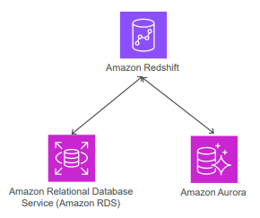

É preciso estabelecer conexão entre o cluster do Redshift e o RDS/Aurora. Ambos precisam estar na mesma VPC Subnet ou criar um VPC Peering caso estejam em VPCs diferentes.

As credenciais também precisam estar no Secrets Manager.

O acesso do Redshift ao external data source é `read-only`.