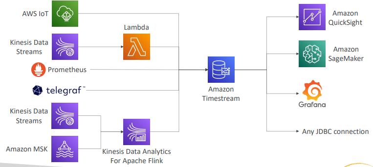

#  Estudos de Amazon Timestream

Estudos do Amazon Timestream.

> **Sumário**
>
> - [1. Introdução](#1-introdução)

---

## 1. Introdução

É um NoSQL Database para séries temporais totalmente gerenciado, rápido, escalável e serverless.

Faz scale up/down automaticamente da capacidade.

Armazena e analisa trilhões de eventos por dia.

É milhares de vezes mais rápido e custa 1/10 do custo de um banco de dados relacional.

É possível schedular queries, suporta multi-measure records e é compatível com SQL.

`Data Storage Tiering`: dados recentes são armazenados na memória e dados históricos são mantidos em storage de custo otimizado.

Possui funções nativas de analytics sobre as séries temporais, que te ajuda a identificar padrões nos dados em quase tempo-real.

Suporta criptografia em repouso e em trânsito.

Use cases: IoT apps, aplicações operacionais, real-time analytics,...

---
